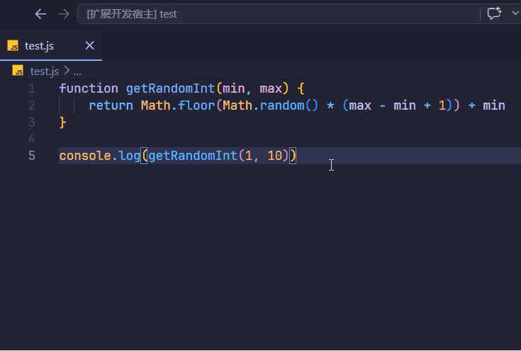
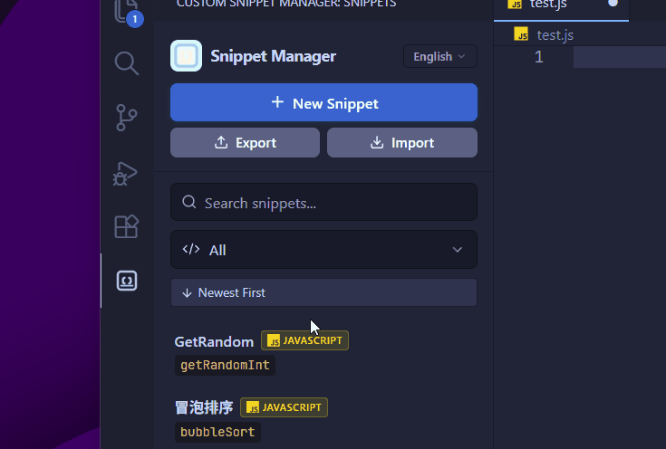
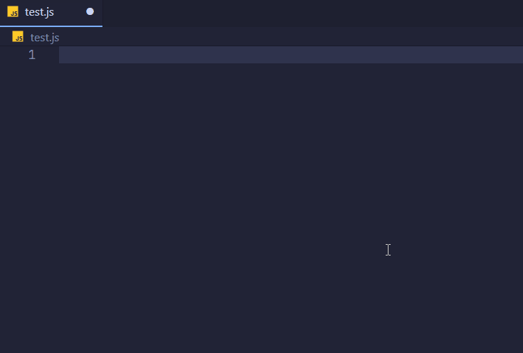
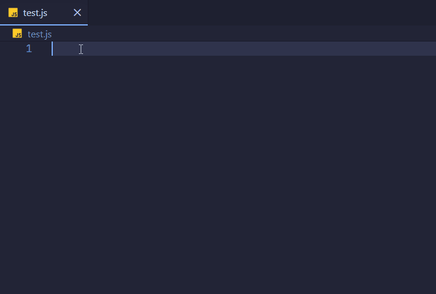
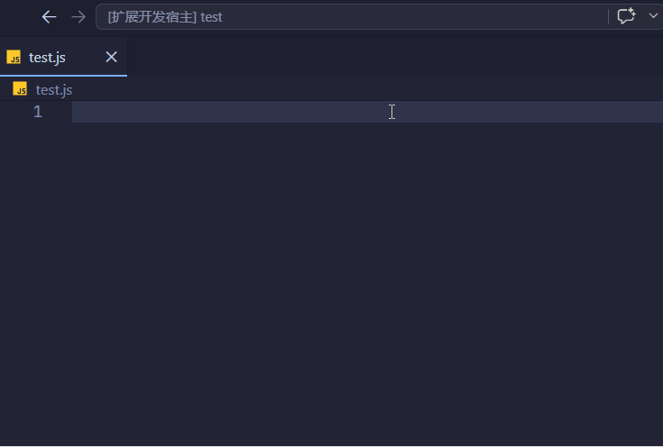

<div align="center">
  
  <h1>Custom Snippet Manager</h1>
  <p>
    <a href="https://marketplace.visualstudio.com/items?itemName=Horyce.custom-snippet-manager">
      
    </a>
    <a href="https://github.com/horyce/vscode-custom-snippet-manager/blob/main/LICENSE">
      
    </a>
    <a href="./README.md">
      
    </a>
    <a href="./README.zh-CN.md">
      
    </a>
  </p>
  <p>🚀 A powerful snippet manager for VS Code with a modern UI, smart autocomplete, and multi-language support.</p>
  <p>✨ Create, organize, and instantly reuse your code snippets — all in one place.</p>
</div>

---

## ✨ Features

### 🧠 Smart Snippet Management

* Create, edit, and delete snippets with an intuitive UI
* Organize snippets by language or use them globally
* Automatically saved locally — no manual file handling needed

### ⚡ Powerful Autocomplete

* Trigger snippets instantly using prefixes
* Supports editing multiple positions with Tab navigation (using `$1`, `$2`, `$0` placeholders)
* Language-aware suggestions
* Fuzzy matching for faster searching

### 🎨 Modern UI Experience

* Sidebar panel with search, filtering, and sorting
* Built-in code editor with syntax highlighting (CodeMirror 6)
* Fast fuzzy search powered by Fuse.js
* Seamless integration with VS Code theme

### 🌐 Multi-language Support


* Supports 25 languages: 简体中文 / 繁體中文 / English / 日本語 / 한국어 / Русский / Deutsch / Français / Español / Português / Italiano / Polski / Türkçe / Svenska / Dansk / Suomi / Nederlands / Čeština / Magyar / ไทย / Tiếng Việt / Українська / Română / Ελληνικά / हिन्दी
* Easily switch between languages
* Language preference is saved automatically

### 📂 Folder Management


* Organize snippets into folders for better categorization
* Drag-and-drop to reorder folders
* Multi-select mode for batch folder deletion
* Default folder automatically collects uncategorized snippets

### 💼 Import & Export

* Export snippets by folder as JSON with metadata
* One-click backup all data as a ZIP file
* Secure import with validation
* Handle duplicates with:

  * Overwrite
  * Skip
  * Merge

### 🖱️ Save Code as Snippet (Highlight Feature 🔥)

* Select any code in the editor
* Right-click → Save directly to snippet library
* No need for copy & paste

---

## 📖 Usage  `The following demonstration uses the old interface.`

### ➕ Create Snippets

**Method 1: Right-click**



**Method 2: UI Panel**



---

### ⚡ Use Snippets

**Autocomplete**



**Right-click Menu**



**Quick Pick**



---

## ✨ Snippet Syntax

```javascript
console.log('$1', $2);$0
```

* `$1` First cursor position
* `$2` Next position (Tab to jump)
* `$0` Final cursor position

---

## ⌨️ Commands & Shortcuts

| Command                 | Shortcut                       | Description                  |
| ----------------------- | ------------------------------ | ---------------------------- |
| New Snippet             | —                              | Create a new snippet         |
| Open Snippet Library    | —                              | Open sidebar panel           |
| Insert Snippet          | Ctrl+Alt+I / Cmd+Alt+I         | Insert snippet via QuickPick |
| Trigger Completion      | Ctrl+Alt+Space / Cmd+Alt+Space | Trigger autocomplete         |
| Save to Snippet Library | Context Menu                    | Save selected code           |

---

## 🗂️ Supported Languages

Supports 50+ popular programming languages and file formats

---

## 💾 Data Storage

Snippets are stored in VS Code global storage:

* Windows: `%APPDATA%\Code\User\globalStorage\custom-snippet-manager\`
* macOS: `~/Library/Application Support/Code/User/globalStorage/custom-snippet-manager/`
* Linux: `~/.config/Code/User/globalStorage/custom-snippet-manager/`

---

## 📦 Installation

1. Open VS Code
2. Go to Extensions (`Ctrl+Shift+X`)
3. Search **Custom Snippet Manager**
4. Click Install

---

## 🤝 Contributing

Issues and Pull Requests are welcome:

👉 https://github.com/horyce/vscode-custom-snippet-manager

---

## 👥 Team

Horyce

---

## 📬 Contact

For feedback, bug reports, or feature requests:

* Email: [smh070912@gmail.com](mailto:smh070912@gmail.com)

---

## 📄 License

MIT License
