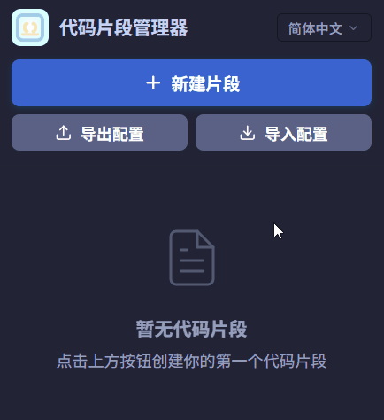
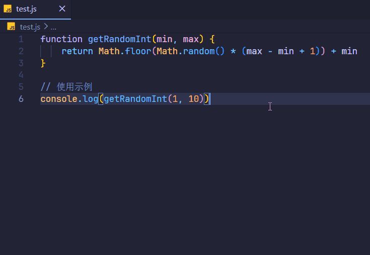
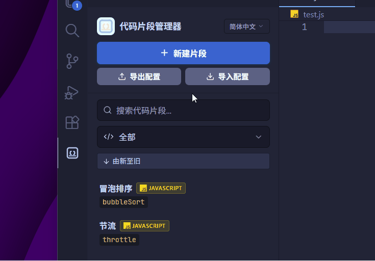
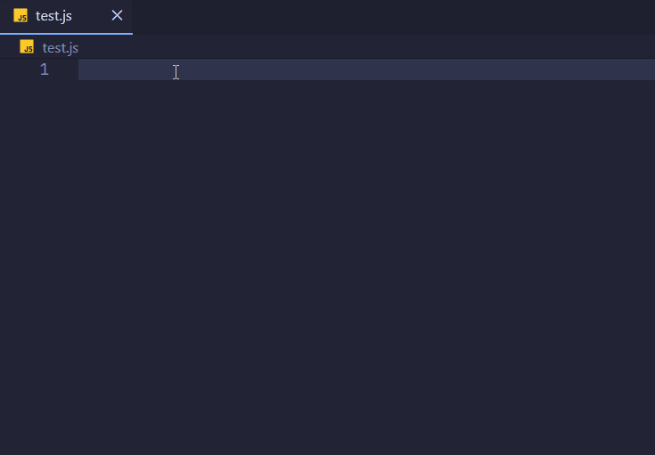
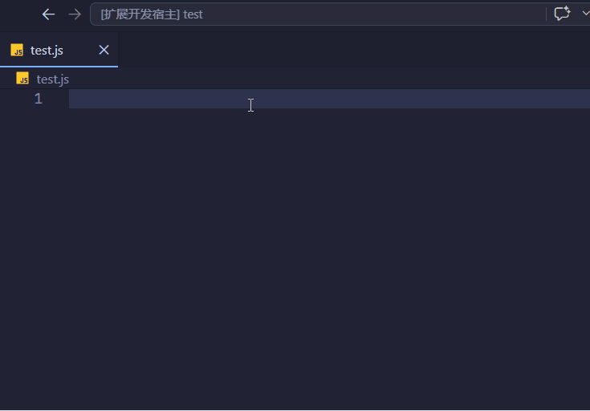

# Custom Snippet Manager - 自定义片段管理器

[](https://marketplace.visualstudio.com/)
[](https://github.com/horyce/vscode-custom-snippet-manager/blob/main/LICENSE)

🚀 一个强大的 VS Code 代码片段管理插件，提供现代化界面、智能补全和多语言支持。
✨ 让你轻松创建、管理并快速复用代码片段，大幅提升编码效率。

---

## 🌐 语言

[](./README.md)
[](./README.zh-CN.md)

---

## ✨ 核心功能

### 🧠 智能片段管理

* 通过直观的界面创建、编辑、删除代码片段
* 支持按语言分类或全局使用
* 自动本地保存，无需手动管理文件

### ⚡ 强大的代码补全

* 输入前缀即可快速触发片段
* 支持多位置编辑（按 Tab 键切换，基于 `$1`、`$2`、`$0` 占位符）
* 根据当前文件语言智能筛选
* 支持模糊匹配，提高查找效率

### 🎨 现代化 UI 体验

* 侧边栏面板：列表、搜索、筛选一体化
* 内置代码编辑器（支持语法高亮）
* 模糊搜索（Fuse.js）
* 界面风格与 VS Code 完美融合

### 🌐 多语言支持



* 支持 简体中文 / 繁體中文 / English / 日本語 / 한국어
* 一键切换语言
* 自动记住用户语言偏好

### 💼 导入与导出

* 一键导出为 JSON（包含元数据）
* 安全导入并自动校验
* 重复片段处理方式：

  * 覆盖
  * 跳过
  * 合并

### 🖱️ 一键保存代码（亮点功能🔥）

* 在编辑器中选中代码
* 右键 → 直接保存到片段库
* 无需手动复制粘贴

---

## 📖 使用方法

### ➕ 创建代码片段

**方式一：右键创建**



**方式二：界面创建**



---

### ⚡ 使用代码片段

**自动补全**


**右键菜单**



**快速选择**



---

## ✨ 片段语法

```javascript
console.log('$1', $2);$0
```

* `$1`：第一个光标位置
* `$2`：下一个位置（Tab 跳转）
* `$0`：最终光标位置

---

## ⌨️ 命令与快捷键

| 命令     | 快捷键                            | 说明       |
| ------ | ------------------------------ | -------- |
| 新建片段   | —                              | 创建新的代码片段 |
| 打开片段库  | —                              | 打开侧边栏    |
| 插入片段   | Ctrl+Alt+I / Cmd+Alt+I         | 快速插入片段   |
| 触发补全   | Ctrl+Alt+Space / Cmd+Alt+Space | 触发代码补全   |
| 保存到片段库 | —                              | 保存选中代码   |

---

## 🗂️ 支持的语言

支持 50+ 常见编程语言与文件格式

---

## 💾 数据存储

代码片段保存在 VS Code 全局存储目录：

* Windows: `%APPDATA%\Code\User\globalStorage\custom-snippet-manager\`
* macOS: `~/Library/Application Support/Code/User/globalStorage/custom-snippet-manager/`
* Linux: `~/.config/Code/User/globalStorage/custom-snippet-manager/`

---

## 📦 安装

1. 打开 VS Code
2. 进入扩展市场（Ctrl+Shift+X）
3. 搜索 **Custom Snippet Manager**
4. 点击安装

---

## 🤝 贡献

欢迎提交 Issue 或 Pull Request：

👉 https://github.com/horyce/vscode-custom-snippet-manager

---

## 👥 开发团队

Horyce & GLM 5.1（AI 辅助）

---

## 📬 联系方式

如果你有任何建议或问题，欢迎联系：

* 邮箱：[smh070912@gmail.com](mailto:smh070912@gmail.com)

---

## 📄 许可证

MIT License
